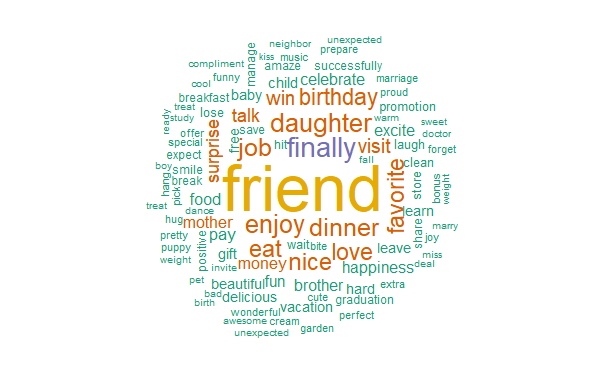
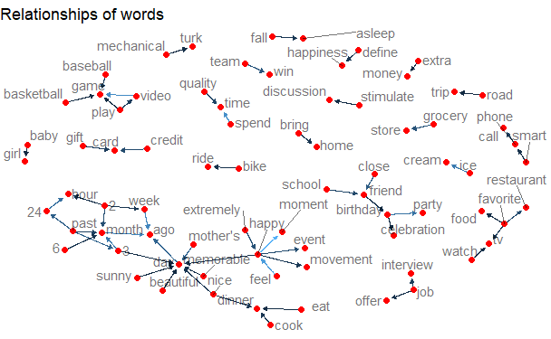

# Project 1: Text mining of HappyDB


### [Project Description](doc/Proj1_desc.md)
This is the first and only ***individual*** (as opposed to *team*) this semester. This project is finished by **Guanren Wang**

### Project summary:
+ Analyzed and visualized frequent key words regarding happiness and implemented sentiment analysis to explore and compare the different degrees of happiness between different genders and between age groups
+ Explored and visualized the relationships between key words in order to uncover causes of happiness
+ Identified the latent cause for the discrepancy between Americans’ happiness and Indians’ happiness using Latent Dirichlet Allocation 

### Examples of Illustrations





Following [suggestions](http://nicercode.github.io/blog/2013-04-05-projects/) by [RICH FITZJOHN](http://nicercode.github.io/about/#Team) (@richfitz). This folder is orgarnized as follows.

```
proj/
├── lib/
├── data/
├── doc/
├── figs/
└── output/
```

Please see each subfolder for a README file.
