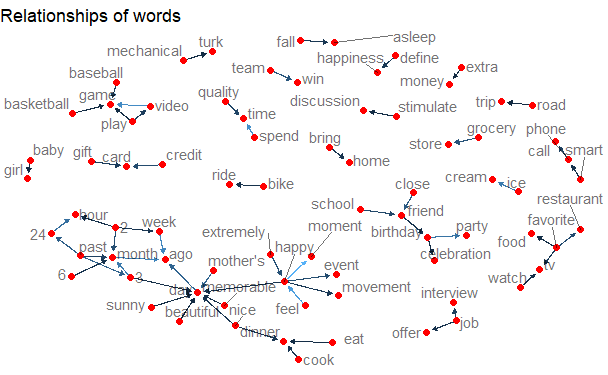

# Project 1: Text mining of HappyDB


### [Project Description](doc/Proj1_desc.md)
This is the first and only ***individual*** (as opposed to *team*) this semester. This project is finished by **Guanren Wang**

### Background
HappyDB is a corpus of 100,000 crowd-sourced happy moments. The goal of the corpus is to advance the state of the art of understanding the causes of happiness that can be gleaned from text.

You may find HappyDB here: [Link](https://rit-public.github.io/HappyDB/)

### Project Summary:
+ Analyzed and visualized frequent key words regarding happiness and implemented sentiment analysis to explore and compare the different degrees of happiness between different genders and between age groups
+ Explored and visualized the relationships between key words in order to uncover causes of happiness
+ Identified the latent cause for the discrepancy between Americans’ happiness and Indians’ happiness using Latent Dirichlet Allocation 

### Complete Data Story: [Text mining of HappyDB](http://rpubs.com/Grandeur/Text_mining_and_NLP_of_happyDB)

### Examples of Visualizations





Following [suggestions](http://nicercode.github.io/blog/2013-04-05-projects/) by [RICH FITZJOHN](http://nicercode.github.io/about/#Team) (@richfitz). This folder is orgarnized as follows.

```
proj/
├── lib/
├── data/
├── doc/
├── figs/
└── output/
```

Please see each subfolder for a README file.
